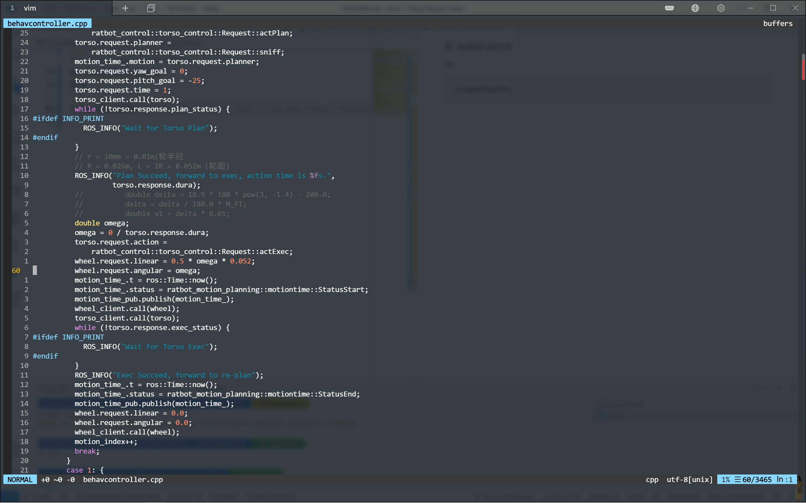

# nvim
neo-vim settings

## 1. neo-vim installation
### 1.1 AppImage ("universal" Linux package)
```
$ curl -LO https://github.com/neovim/neovim/releases/latest/download/nvim.appimage
$ chmod u+x nvim.appimage
$ ./nvim.appimage
```
For more information, see [neovim page on GitHub](https://github.com/neovim/neovim/wiki/Installing-Neovim)
### 1.2 From the repository
1. Add the repository<br>
```
$ sudo add-apt-repository ppa:neovim-ppa/unstable
```
2. Update and install<br>
```
$ sudo apt-get update
$ sudo apt-get install neovim
```
## 2. package download and installation
### 2.1 download the setting
```
$ mkdir ~/.config && cd ~/.config
$ git clone --recursive https://github.com/Zeffiretti/nvim.git
```
### 2.2 install YouCompleteMe
1. dependics installation
```
$ sudo apt install build-essential cmake vim-nox python3-dev
$ apt install mono-complete golang nodejs default-jdk npm
```
2. compile YCM
```
$ cd ~/.config/nvim/bundle/YouCompleteMe
$ python3 install.py --all
```
## 3. other installation
### 3.1 ctag
```
$ sudo apt-get install ctags
```
### 3.2 pip3 and neovim python package
```
$ sudo apt-get -y install python3-pip
$ pip install neovim
$ pip3 install neovim
```
## 4. solve error
try in vim
```
:checkhealth
```